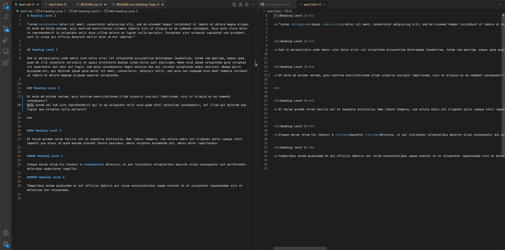

# Markdown-Interpreter

## What is It?

This project is written in Haskell and is a program that can convert a Markdown language file to an HTML file that can be displayed in a browser. To use this application you can simply download the executable file from the [git repository](https://github.com/kepleywl/Markdown-Interpreter). This program can be used to create a draft for an HTML site given that you know how to use Markdown syntax. The Markdown syntax used is outlined on this [page](https://www.markdownguide.org/basic-syntax/).

***

## Customizing the Application 

If you prefer more control of how the Markdown is interpreted you are free to edit the source code for the application and compile your own Markdown Interpreter. To achieve this you are going to need to install the [Glasgow Haskell Compiler (GHC)](https://www.haskell.org/ghc/). Once you have installed the compiler you can simply clone the [repository](https://github.com/kepleywl/Markdown-Interpreter) and edit the markdown.hs file. Once you have made the changes you desire you can compile the file into an executable that can be then used to interpret Markdown files.

***

## Interpreting a Markdown File

To begin open up a Terminal and navigate to the directory that contains the executable named **markdown**. Also, make sure that Markdown file you wish to interpret is also in the same directory. Next begin by executing the command.

> ./markdown

You should then see the following text.

> Enter file name without extension:

Next type in the name of your file in the terminal and hit enter. If your file is successfully parsed you should see a parsing output of the file (this is useful for debugging if there are issues) and a .html file with the same prefix as the Markdown file you used as input. 

To see an example of this refer to the following:

As you can see after running the program a test1.html file appears in the current directory. Included in the github repository are several test examples of .md files and their corresponding .html to show examples of what the program is capable of.

***

## Editing the Parser

If you wish to customize the parser to your own liking or implement new features that are not currently supported you can do so by editing the markdown.hs file. If you feel you have made improvements to the parser feel free to submit a pull request to the github repository. Once you have made the changes you will need to compile your new markdown converter executable file.

To compile the file you will want to navigate to the directory containing the markdown.hs file and run the following command in the terminal:

> ghc markdown.hs -o markdown 

If you wish to name your executable file something other than "markdown" replace the word "markdown" in the command with whatever you want the name of your executable to be.

***

## FAQ

**Why is the output .html file is blank after running the program?**

* This program is still in beta and still being developed. If you believe that the Markdown language that you typed is correct but the program is unable to parse your file it is possible that you are using a feature that has not been implemented such as nested list elements, images, and links. If you are not using any of these features in your markdown pay attention to the output of the parser when you run the program as this can help you find problems with the parse. Lots of issues can be resolved by simply changing the spacing inside the Markdown file as the parser is sensitive to spaces between items.  

 

**I edited the source code file but it won't compile with the command given... what gives?**

* There could be several problems here. First make sure that you are getting a ghc compilation error and not a *command not found error* from your terminal. If you are seeing command not found when you are using *ghc* then make sure that you have installed the current Haskell compiler version and make sure that it has been added to your PATH variables. If you are seeing a compilation error from ghc then it is likely you have a syntax error in the edits you made. In this case you will need to look at the error you are getting from the compiler and investigate what could be causing this issue. Usually a google search of the error is a good place to start.

 

**The HTML tags generated are not in the order I intended after converting my Markdown file**

* Because of the ambiguity between the conversion of Markdown to HTML it is possible that HTML do not appear in the intended order. This is due to how the parser behaves when parsing the text but it should still output the correct visual intent when the .html file is displayed in a browser. If you believe there is a bug with the code feel free to submit an issue to the [github repository](https://github.com/kepleywl/Markdown-Interpreter).

***

## Troubleshooting

For issues that come up while attempting to edit or run the parser application there are several resources you can use in addtion to the FAQs on this page.

For issues with installing the GHC compiler please refer to: [Glasgow Haskell Compiler (GHC)](https://www.haskell.org/ghc/).

For issues with writing Haskell there are several questions answered on StackOverflow and for learning Haskell a great resource is [Learn You a Haskell for Great Good](http://learnyouahaskell.com/).

If you believe there are any issues with the current version of the parser application please submit an issue on [GitHub](https://github.com/kepleywl/Markdown-Interpreter).

## How to Contribute

If you believe that you have made improvements to the current version of the parser application I welcome you to submit a pull request on [GitHub](https://github.com/kepleywl/Markdown-Interpreter). If your request seems reasonable and improves the program I will be happy to push it to the current main repository.

## Support

If you find an issue with the project code feel free to create an [issue](https://github.com/kepleywl/Markdown-Interpreter/issues) using GitHub.

For other inquiries feel free to contact me at kepleywl@appstate.edu.

 

***

 

This repository is licensed under the GNU GPL license.

Contact: kepleywl@appstate.edu